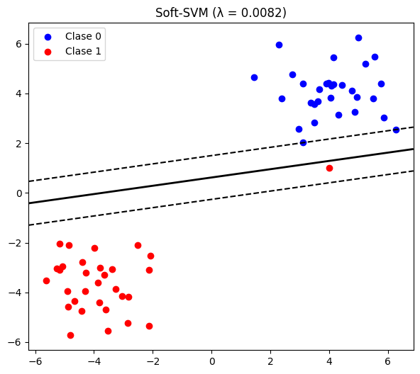
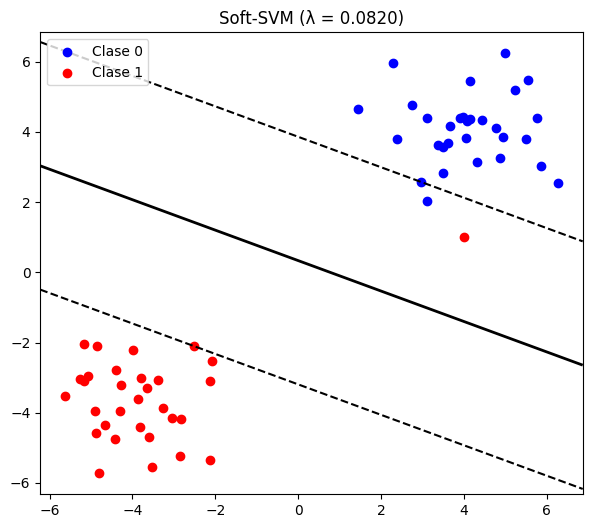
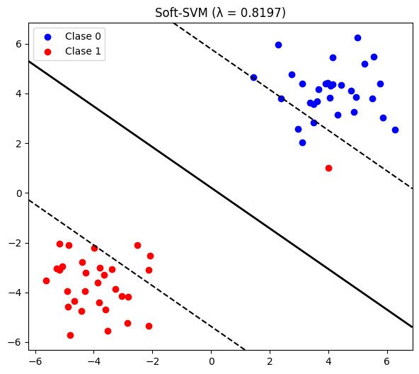
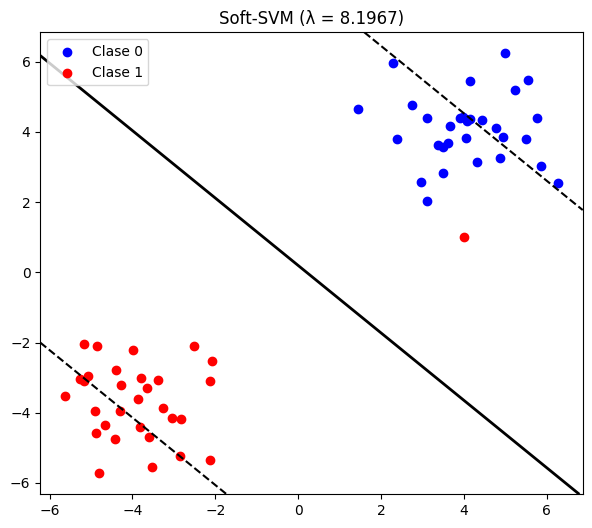
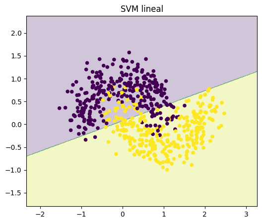
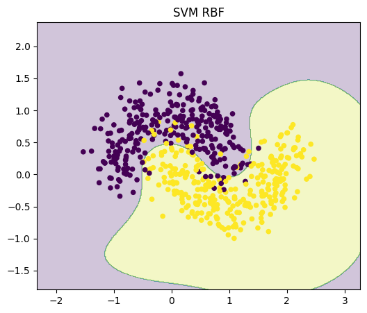
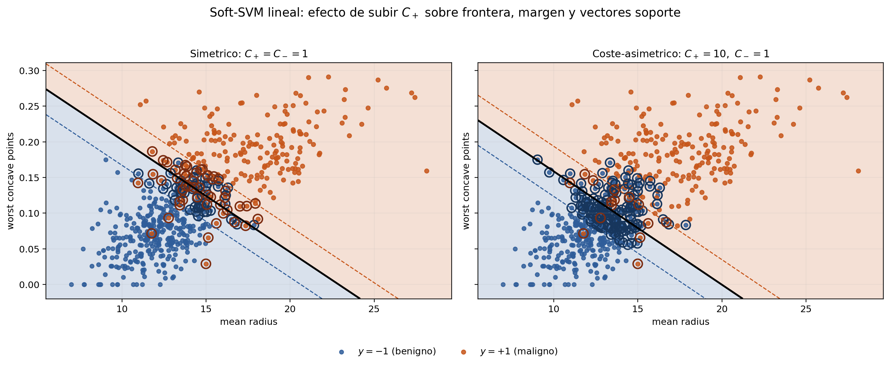
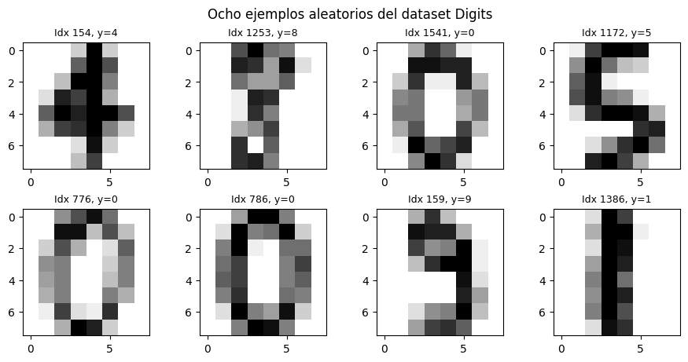
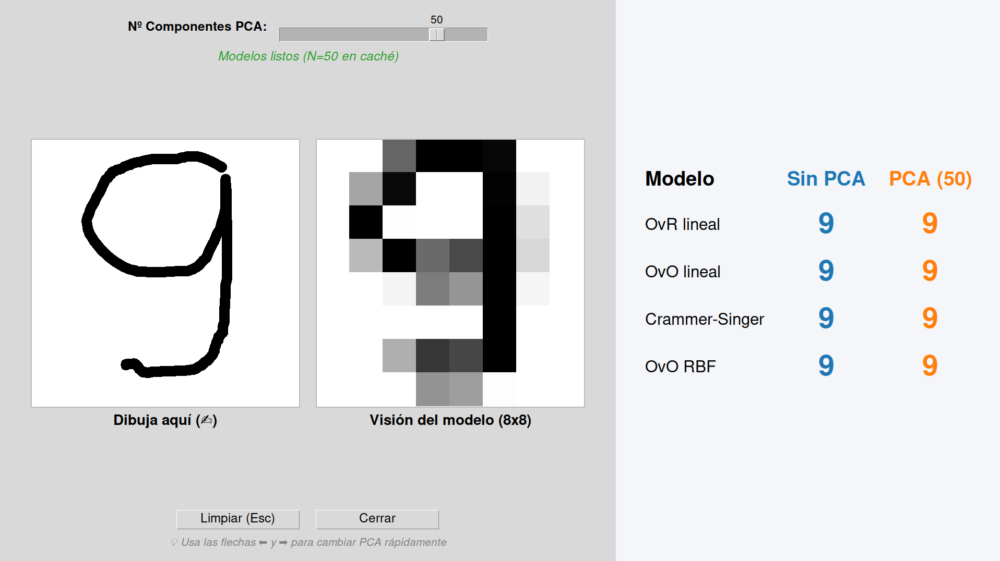

# Support Vector Machines (SVMs)

**Integrantes del grupo:** Fernando, Julia, Hugo y Mario

## Descripción del proyecto

Este proyecto explora de forma práctica la teoría y aplicación de las Máquinas de Vectores de Soporte (SVM). Acompañando a nuestro análisis teórico sobre Hard-SVM, Soft-SVM, métodos de kernel, costes asimétricos y clasificación multiclase que se pueden consultar en el [informe](informe/build/informe.pdf), hemos desarrollado varios experimentos prácticos utilizando la librería `scikit-learn` de Python.

El código fuente está dividido en los siguientes Jupyter Notebooks:

* **[SOFT_SVM.ipynb](SOFT_SVM.ipynb)**: Ejemplos y visualizaciones del algoritmo Soft-SVM con datos sintéticos, analizando el efecto de las variables de holgura y el parámetro de regularización. Este script genera las siguientes figuras (que también se incluyen en el [informe](informe/build/informe.pdf)):

    
    
     
    
    

* **[SVM_RBF_moons.ipynb](SVM_RBF_moons.ipynb)**: Uso de métodos kernel (como RBF) frente a métodos lineales para resolver problemas de clasificación en un conjunto de datos sintético que no es linealmente separable.

    
    

* **[SVM_costes_asimetricos_cancer.ipynb](SVM_costes_asimetricos_cancer.ipynb)**: Aplicación de SVM con costes asimétricos para el cribado de cáncer de mama, priorizando minimizar los falsos negativos frente a los falsos positivos. Este notebook incluye una comparativa visual de los resultados obtenidos con diferentes valores del parámetro de coste asimétrico $C_+$, que también se pueden consultar en el [informe](informe/build/informe.pdf):

    

* **[SVM_multiclase_digits.ipynb](SVM_multiclase_digits.ipynb)**: Implementación y comparativa de estrategias multiclase (One-vs-Rest frente a One-vs-One) aplicadas al clásico problema del reconocimiento de dígitos:

    

Este script también incluye una demo interactiva que permite al usuario dibujar un dígito a mano alzada y obtener las predicciones de distintos modelos.    

    

## Informe

Puedes consultar el informe completo con el análisis teórico en el siguiente enlace: [ver informe](informe/build/informe.pdf). También se ha incluido el código LaTeX del informe en el repositorio para su consulta: [informe.tex](informe/informe.tex).
